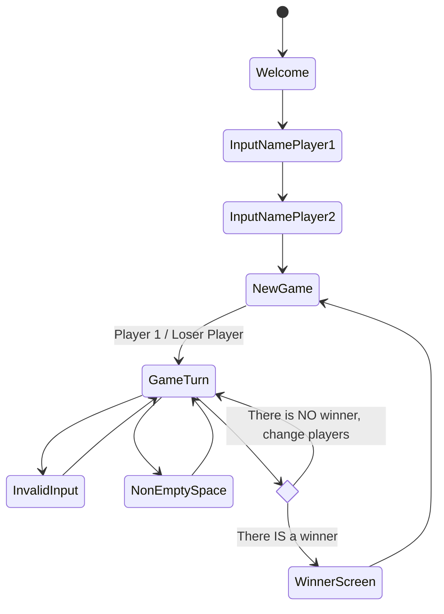

# Curso-Unifel-Games-Trabalho-02

Segundo trabalho do curso `Desenvolvimento de Jogos_Games_Turma 03` da Unifel.

## Requisitos

## State Flow Chart

```mermaid
stateDiagram-v2
    Welcome
    InputNamePlayer1
    InputNamePlayer2
    NewGame
    GameTurn
    InvalidInput
    WinnerScreen
    NonEmptySpace
    state is_there_a_winner <<choice>>

    [*] --> Welcome
    Welcome --> InputNamePlayer1
    InputNamePlayer1 --> InputNamePlayer2
    InputNamePlayer2 --> NewGame
    NewGame --> GameTurn: Player 1 / Loser Player
    GameTurn --> InvalidInput
    InvalidInput --> GameTurn
    GameTurn --> NonEmptySpace
    NonEmptySpace --> GameTurn
    GameTurn --> is_there_a_winner
    is_there_a_winner --> GameTurn : There is NO winner, change players
    is_there_a_winner --> WinnerScreen : There IS a winner
    WinnerScreen --> NewGame
```
